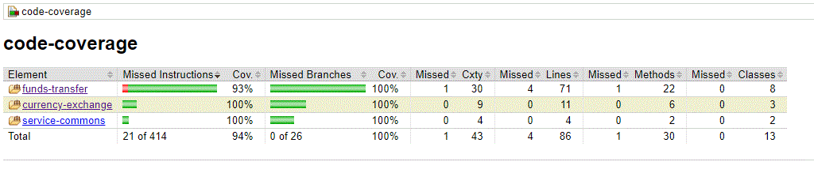

# Finance App

Finance App is a multi-module project that includes `currency-exchange` and `funds-transfer` services. This README
provides steps to build and run the application.

## Prerequisites

- Java 17 or higher
- Maven 3.9.9 or higher, although we are using a maven wrapper so project will work even if maven is not installed.
- IDE similar to IntelliJ to explore codebase

## Project Structure, Architecture and Requirements

- `finance-app` - The parent project containing shared configuration.
- `currency-exchange` - Service for handling currency exchange rates.
- `funds-transfer` - Service for handling funds transfers between accounts.
- `service-commons` - Beans jar to store common api-paths, models etc
- `coverage-report` - Module for aggregating test coverage reports and other docs.

### Architecture

For architecture overview, please refer:<br>

[Architecture.md](code-coverage-report/docs/Architecture.md)

### Requirements

For the assignment requirements and their fulfilment criteria, please refer:<br>

[Requirements.md](code-coverage-report/docs/Requirements.md)

## Getting Started

### Clone the Repository

Clone repo, [finance-app](https://github.com/Elaserph/finance-app.git) and open it in an IDE like IntelliJ

### Build and Run

Please open terminal, navigate to `finance-app` folder and follow the steps, by default, the project will build using `dev` maven profile:

#### Build the whole project:

- On Windows:

```bash
./mvnw.cmd clean install
```

- On Linux/macOS:

```bash
./mvnw clean install
```

#### Once the whole project build is done, navigate to `currency-exchange` directory (on a new terminal):

```bash
cd currency-exchange
```

#### Once in `currency-exchange` directory, Run `currency-exchange` service:

- On Windows:

```bash
../mvnw.cmd spring-boot:run
```

- On Linux/macOS:

```bash
../mvnw spring-boot:run
```

#### Once `currency-exchange` service is up, navigate to `funds-transfer` directory:

```bash
cd funds-transfer
```

#### Once in `funds-transfer` directory, Run `funds-transfer` service:

- On Windows:

```bash
../mvnw.cmd spring-boot:run
```

- On Linux/macOS:

```bash
../mvnw spring-boot:run
```

#### Once both services are up and running, following are the relevant resources to access/test the services:

Note: As mentioned earlier, the `dev` profile is active by default when building the project. <br>
The resources and configurations provided are specific to the `dev` profile. For this assignment purpose, <br>
I have just defined `dev` profile, though the concept can be extended to have `prod` or `stage` profile as well!

| property/service              | `currency-exchange`                                | `funds-transfer`                      |
|-------------------------------|----------------------------------------------------|---------------------------------------|
| Application Server            | localhost:8080                                     | localhost:8081                        |
| Endpoints                     | GET /api/exchange-rate/{currencyFrom}/{currencyTo} | POST /api/funds-transfer              |
| Request body                  | Not required                                       | Required, see examples below          |
| API docs                      | http://localhost:8080/v3/api-docs                  | http://localhost:8081/v3/api-docs     |
| Swagger url to test endpoints | http://localhost:8080/swagger-ui.html              | http://localhost:8081/swagger-ui.html |
| H2 database url               | http://localhost:8080/h2-console                   | http://localhost:8081/h2-console      |
| H2 datasource JDBC url        | jdbc:h2:mem:exchangeDbDev                          | jdbc:h2:mem:accountDbDev              |

Sample request bodies for `funds-transfer` api:

```json
  {
  "ownerId": 19,
  "senderAccount": "ACC1937",
  "receiverAccount": "ACC2040",
  "transferAmount": 10,
  "transferAccountCurrency": "USD"
}
  ``` 

```json 
  {
  "ownerId": 22,
  "senderAccount": "ACC2243",
  "receiverAccount": "ACC2141",
  "transferAmount": 500,
  "transferAccountCurrency": "EUR"
}
  ```

Please refer the integration tests or data.sql files for more examples.

#### Stop the services:

To stop them, go to the individual terminals running the services and press `ctrl+c`.

## Code Coverage

Snapshot of code-coverage of last build:


To access the latest generated aggregated report after a **clean install** (present in target folder, won't commit to GitHub by default): <br>
[Code Coverage html report](code-coverage-report/target/site/jacoco-aggregate/index.html)

## Author
[Shreepal](https://www.linkedin.com/in/elaserph)